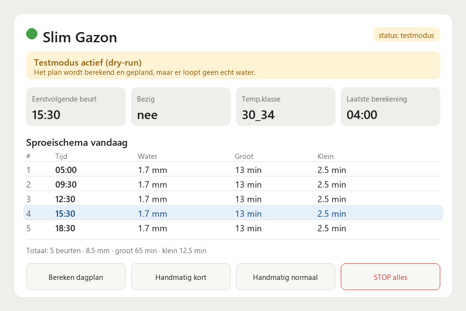

# Slim Gazon Sproeien

Een Home Assistant custom integration die je gazon **weerafhankelijk** en
**slim** water geeft. De integratie berekent elke ochtend een dagplan op basis
van temperatuur, grasfase (van pas ingezaaid tot bestaand gras), regen
(verwacht én gevallen), wind, zon, UV, luchtvochtigheid en optioneel
bodemvocht. Vervolgens voert hij de geplande sproeibeurten veilig uit met je
twee sproeiers en stopt automatisch bij regen of als een sproeier te lang aan
staat.

Deze integratie is de uitwerking van het oorspronkelijke
`slim_gazon_sproeien.yaml` package: alle helpers, template-sensoren, scripts en
automatiseringen zijn vervangen door één integratie die je via de UI instelt en
bedient.

> ⚠️ **Veiligheid.** Sproeien gebeurt alleen wanneer "Automatisch sproeien"
> aan staat én "Testmodus" uit staat. Na installatie staat de integratie in
> **testmodus** (dry-run): er wordt wel gepland en gelogd, maar er gaat nog geen
> water lopen. Zet testmodus pas uit als je de instellingen hebt gecontroleerd.

## Wat je nodig hebt

| Verplicht | Beschrijving |
|---|---|
| Weer-entiteit | Een `weather.*` entiteit die `weather.get_forecasts` ondersteunt (bv. Buienradar) |
| Temperatuursensor | Huidige temperatuur |
| Grote sproeier | Een `switch` / `valve` / `input_boolean` / `light` die de grote sproeier schakelt |
| Kleine sproeier | Idem voor de kleine sproeier |

Optioneel (maken het plan nauwkeuriger): max-temperatuur vandaag, wind,
luchtvochtigheid, UV, globale straling, regenintensiteit nu, regen laatste 24u,
verwachte regen vandaag, **regen-nowcast (Buienalarm)**, gedetailleerde
weerconditie en bodemvocht.

> 💡 De **regenintensiteit-nu** sensor wordt gebruikt om tijdens een beurt te
> pauzeren als het begint te regenen. Laat je hem leeg, dan is die
> regenonderbreking uitgeschakeld.

> 🌧️ De **regen-nowcast** sensor (bijv. `sensor.neerslag_buienalarm_regen_data`
> uit de [Neerslag-app](https://github.com/aex351/home-assistant-neerslag-app))
> geeft hoge-resolutie regen voor de komende ~2 uur. De integratie leest daaruit
> *hoeveel* en *hoelaat* er regen valt en verfijnt daarmee het plan. Omdat het
> plan **meerdere keren per dag** wordt herberekend (zie hieronder), past het
> zich aan op werkelijke regen die eraan komt.

## Installatie

### Via HACS (aanbevolen)

1. HACS → rechtsboven de drie puntjes → **Custom repositories**.
2. Voeg `https://github.com/basschoren/slim-gazon-sproeien` toe met categorie
   **Integration**.
3. Zoek op **Slim Gazon Sproeien**, installeer en **herstart** Home Assistant.
4. Ga naar **Instellingen → Apparaten & diensten → Integratie toevoegen** en zoek
   op **Slim Gazon Sproeien**.

### Handmatig

Kopieer de map `custom_components/slim_gazon` naar de `custom_components` map van
je Home Assistant configuratie en herstart.

## Configureren

Bij het toevoegen kies je je weer-entiteit, sensoren en de twee
sproeier-schakelaars. Alles wat je hier kiest kun je later wijzigen via
**Configureren** op de integratiekaart (optioneel veld leegmaken = die sensor
niet meer gebruiken). Ook de **tijd van de dagelijkse berekening** (standaard
04:00) stel je hier in. Naast die hoofdtijd herberekent de integratie het plan
automatisch nog **4× per dag** (07:00, 11:00, 13:30 en 16:00), zodat UV,
straling, temperatuur en de regen-nowcast actueel blijven.

Alle overige instellingen (sproeisnelheden, drempels, factoren) zijn
**entiteiten** geworden, zodat je ze vanaf een dashboard kunt aanpassen.

## Entiteiten

De integratie maakt één apparaat met o.a.:

**Bediening**
- `switch` — **Automatisch sproeien** (hoofdschakelaar)
- `switch` — **Testmodus (dry-run)**
- `select` — **Gazon fase** (pas ingezaaid / kiemend / jong gras / bestaand gras / alleen handmatig)
- `date` — **Zaaidatum** (bepaalt het fase-advies)
- `button` — Bereken dagplan, Stop alle sproeiers, Handmatig kort, Handmatig normaal
- `number` — ~21 instelbare parameters (sproeisnelheden mm/min, drempels voor regen/wind/temp/UV/straling/bodemvocht, max runtime, enz.)

**Informatie**
- `binary_sensor` — **Sproeien bezig**
- `sensor` — Status, Dagplan (met alle slots als attribuut), Reden, Temperatuur range,
  Gepland totaal mm, Netto behoefte mm, Geplande grote/kleine minuten,
  Eerstvolgende beurt, Geadviseerde fase, Laatste berekening, en — als er een
  nowcast-sensor is gekozen — **Regen nowcast (komend)** met als attribuut
  `minuten_tot_regen`

Het sensor **Dagplan** bevat in zijn attributen het volledige plan (actieve
slots met tijd, mm en minuten, plus de gebruikte meetwaarden) — handig als basis
voor een eigen dashboard.

## Services

| Service | Wat |
|---|---|
| `slim_gazon.calculate_plan` | Bereken direct een dagplan (met optionele test-overrides) |
| `slim_gazon.run_cycle` | Voer een sproeibeurt uit (grote + kleine minuten, met veiligheidschecks) |
| `slim_gazon.start_big` | Start de grote sproeier voor X minuten |
| `slim_gazon.start_small` | Start de kleine sproeier voor X minuten |
| `slim_gazon.manual_short` | Korte beurt (5 / 1,5 min) |
| `slim_gazon.manual_normal` | Normale beurt (12 / 3 min) |
| `slim_gazon.stop_all` | Stop alles en annuleer een lopende beurt |
| `slim_gazon.test_scenario` | Bereken een plan voor een gesimuleerd weerscenario (testmodus) |

## Hoe het plan werkt (kort)

1. Op de ingestelde tijd (04:00) — en daarna nog om 07:00, 11:00, 13:30 en 16:00 —
   haalt de integratie de uur- en dagverwachting op, leest alle sensoren en
   (indien ingesteld) de hoge-resolutie regen-nowcast. Elke herberekening past
   het plan voor de **resterende** beurten aan op de actuele situatie.
2. Op basis van de **max-temperatuur** wordt een basishoeveelheid water en een
   aantal beurten bepaald, vermenigvuldigd met factoren voor **grasfase** en
   **weer** (lucht­vochtigheid, UV/straling, bewolking, wind).
3. **Regen** (verwacht vandaag, vóór de middag en de laatste 24u) wordt eraf
   getrokken. Bij te veel regen, te harde wind, te nat bodemvocht of fase
   "alleen handmatig" wordt de dag overgeslagen.
4. De netto behoefte wordt verdeeld over maximaal 8 slots met tijden die
   afhangen van temperatuur en fase, en omgerekend naar minuten per sproeier.
5. Elke minuut controleert de integratie of er een slot moet starten en voert
   die veilig uit.

De volledige rekenlogica staat in [`planner.py`](custom_components/slim_gazon/planner.py)
en is een 1-op-1 vertaling van het oorspronkelijke YAML-package.

## Veiligheid

- Sproeit nooit in testmodus of als de hoofdschakelaar uit staat.
- Stopt direct als de regenintensiteit boven de drempel komt.
- **Max runtime**-bewaking zet een sproeier uit die te lang aan staat.
- Zet bij het opstarten van Home Assistant beide sproeiers uit.

## Een eigen dashboard

Wil je het plan overzichtelijk tonen en handmatig bedienen? Gebruik de
bijbehorende Lovelace-kaart
**[Slim Gazon Card](https://github.com/basschoren/slim-gazon-card)** — ook via
HACS te installeren (categorie *Dashboard*):

De kaart toont het dagplan (status, sproeischema, onderbouwing en meetwaarden) en
biedt volledige handmatige bediening. Liever zelf bouwen? Alle gegevens zitten in
`sensor.*_dagplan` (attribuut `slots`) en de bedienings-entiteiten hierboven.

## Licentie

[MIT](LICENSE) · © 2026 Bas Schoren
